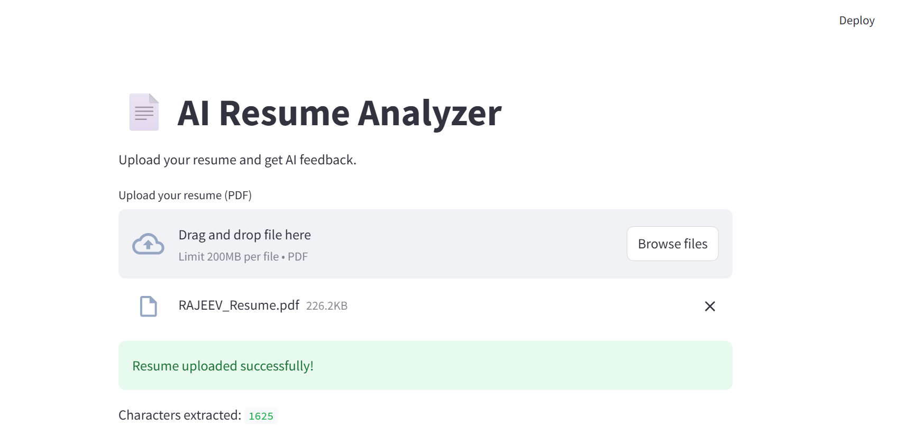
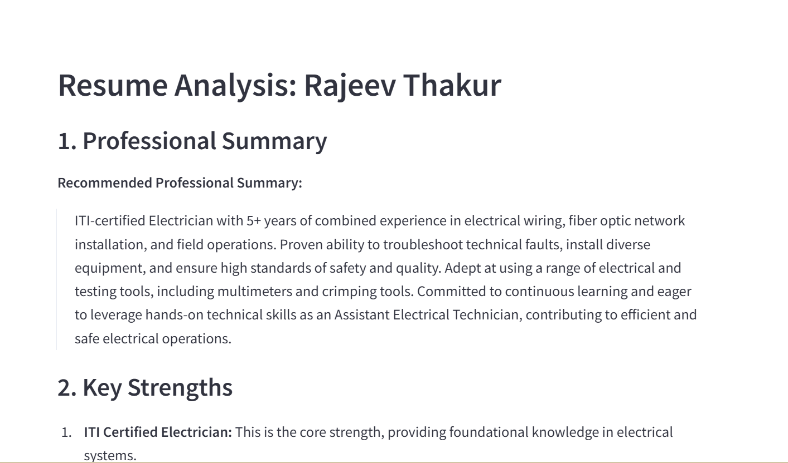

# 📄 AI Resume Analyzer

An AI-powered Resume Analyzer built using **Python**, **Streamlit**, **Google Gemini API**, and **PyPDF2**.

This application allows users to upload a PDF resume and receive AI-generated feedback including:

- Professional Summary
- Key Strengths
- Missing Skills
- Suggested Improvements
- Suitable Job Roles
- Resume Score

---

# 🌐 Live Demo

🚀 **Streamlit Cloud Deployment:**  
[Click Here to Use the App](PASTE_YOUR_STREAMLIT_LINK_HERE)

---

# ✨ Features

✅ Upload PDF Resume  
✅ Extract Resume Text  
✅ AI-Powered Resume Analysis  
✅ Gemini API Integration  
✅ Resume Score Generation  
✅ Clean Streamlit UI  
✅ Real-Time AI Feedback  

---

# 🛠️ Tech Stack

| Technology | Purpose |
|---|---|
| Python | Backend Logic |
| Streamlit | Web Application UI |
| PyPDF2 | PDF Text Extraction |
| Google Gemini API | AI Resume Analysis |
| python-dotenv | Environment Variable Management |

---

# 🧠 Application Workflow

```text
Upload Resume PDF
        ↓
Extract Resume Text
        ↓
Generate AI Prompt
        ↓
Send to Gemini API
        ↓
Receive AI Analysis
        ↓
Display Results
```

---

# 📂 Project Structure

```text
ai-resume-analyzer/
│
├── app.py
├── requirements.txt
├── .gitignore
├── README.md
├── output1.png
└── output2.png
```

---

# 📸 Application Output

## Resume Upload



---

## AI Resume Analysis



---

# ⚙️ Installation

## 1️⃣ Clone Repository

```bash
git clone https://github.com/Gautams1990/ai-resume-analyzer.git
```

---

## 2️⃣ Navigate to Project Folder

```bash
cd ai-resume-analyzer
```

---

## 3️⃣ Create Virtual Environment

### Windows

```bash
python -m venv .venv
```

Activate environment:

```bash
.venv\Scripts\activate
```

---

## 4️⃣ Install Dependencies

```bash
pip install -r requirements.txt
```

---

# 🔑 Setup Gemini API Key

Create a `.env` file locally:

```env
GEMINI_API_KEY=your_api_key_here
```

Get API key from:

https://aistudio.google.com/app/apikey

---

# ▶️ Run Application

```bash
streamlit run app.py
```

---

# ☁️ Deployment

This application is deployed publicly using:

- Streamlit Community Cloud
- GitHub Integration
- Gemini API Secrets Management

---

# 💡 What I Learned

Through this project, I learned:

- PDF text extraction using PyPDF2
- Prompt engineering with Gemini AI
- API integration using google-genai
- Streamlit application development
- Document AI workflow building
- Deployment on Streamlit Cloud
- Environment variable management

---

# 🔮 Future Improvements

- ATS Score Prediction
- Resume vs Job Description Matching
- Downloadable PDF Reports
- OCR Support for Scanned PDFs
- Advanced UI Improvements
- RAG-based Resume Search

---

# 👨‍💻 Author

## Gautam Sharma

GitHub:  
https://github.com/Gautams1990

---

# ⭐ Support

If you like this project, consider giving it a ⭐ on GitHub.
